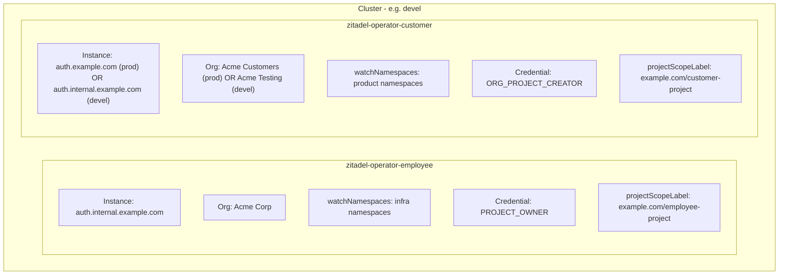

# Multi-Instance Deployment Guide

Reference architecture for deploying multiple zitadel-operator instances side-by-side in a single Kubernetes cluster.

## 1. When You Need Multiple Operators

Deploy multiple operators when:

- **Separate identity providers** — one cluster hosts both an internal employee IdP and an external customer IdP (different Zitadel instances or different orgs on the same instance)
- **Organization-level isolation** — a single Zitadel instance has multiple organizations with different permission levels (e.g., infra team vs. product team)
- **Compliance boundaries** — ISO 27001 or SOC 2 requirements demand that dev environments never touch production customer identity data

Each operator instance binds to exactly one Zitadel domain + organization via its config file. To manage resources across multiple instances or orgs, deploy one operator per target.

## 2. Reference Architecture



**Employee operator** manages infrastructure identity — internal tools (ArgoCD, monitoring dashboards, gateways) that authenticate employees via corporate SSO.

**Customer operator** manages product identity — customer-facing services (billing, API platform, storefronts) that authenticate external users.

## 3. Namespace Labels and Project Scope Enforcement

### What `projectScopeLabel` Does

Added in v0.12.0, `projectScopeLabel` validates that a namespace has a label whose value matches the expected Zitadel project name before the operator reconciles any CRD in that namespace.

This prevents accidental cross-instance placement — for example, a customer `OIDCApp` accidentally created in an infrastructure namespace that the employee operator watches.

### Behavior Matrix

| Label state                     | Operator behavior                                        |
| ------------------------------- | -------------------------------------------------------- |
| Label present, value matches    | Reconcile normally                                       |
| Label present, value mismatches | Reject — sets `ProjectScopeMismatch` condition on the CR |
| Label missing                   | Reject (fail-closed when `projectScopeLabel` is set)     |
| Config empty (`""`)             | No enforcement — backward-compatible                     |

### Example Namespace Labels

```yaml
apiVersion: v1
kind: Namespace
metadata:
  name: billing
  labels:
    # Employee operator reads this label — value must match the employee project name
    example.com/employee-project: cluster-devel
    # Customer operator reads this label — value must match the customer project name
    example.com/customer-project: billing-devel
```

A namespace can carry both labels if resources from both operators are expected (uncommon). Typically, each namespace belongs to exactly one operator's domain.

## 4. Credential Model

### Two Patterns

| Pattern                 | Operator | Capabilities                                                         |
| ----------------------- | -------- | -------------------------------------------------------------------- |
| **PROJECT_OWNER**       | Employee | Manages existing projects (pre-created by IaC), creates apps/roles   |
| **ORG_PROJECT_CREATOR** | Customer | Can create new projects in its org, self-provisions per-app projects |

The employee operator works with projects that already exist (created by Terraform/Pulumi during cluster bootstrap). The customer operator creates projects on demand — each product service gets its own Zitadel project.

### Secret Configuration

Each operator mounts its own JWT key Secret:

```yaml
# Employee operator
credentials:
  secretName: zitadel-employee-key
  key: key.json

# Customer operator
credentials:
  secretName: zitadel-customer-key
  key: key.json
```

Secrets are typically provisioned via External Secrets Operator (ESO) from a cloud secret store (AWS SSM, GCP Secret Manager, HashiCorp Vault). The operator never creates or rotates these keys — that's handled by infrastructure automation.

## 5. Namespace Isolation Pattern

Three layers enforce isolation:

### Layer 1: `watchNamespaces` (operator config)

Each operator only watches its own namespaces. Events from other namespaces are ignored at the informer level — the operator never sees them.

### Layer 2: Kubernetes RBAC (Role + RoleBinding)

The Helm chart creates namespace-scoped `Role` + `RoleBinding` pairs (not a `ClusterRole`) when `rbac.namespaces` is set. The operator's ServiceAccount can only read/write CRs in its declared namespaces.

Even if a misconfiguration adds a namespace to `watchNamespaces`, RBAC prevents the operator from acting on resources it shouldn't touch.

### Layer 3: `projectScopeLabel` (operator enforcement)

The operator validates the namespace label before reconciling. This catches the case where a CR is placed in a correctly-watched namespace but targets the wrong Zitadel project.

```
┌─────────────────────────────────────────────────────┐
│  K8s API Server (RBAC)                              │  ← Layer 2: can't even list CRs
│    └─ Informer (watchNamespaces filter)             │  ← Layer 1: events filtered
│        └─ Reconciler (projectScopeLabel check)      │  ← Layer 3: semantic validation
│            └─ Zitadel API call                      │
└─────────────────────────────────────────────────────┘
```

## 6. Devel Environment Special Case

In development and test environments, you typically don't want to interact with the production customer Zitadel instance. The pattern:

- The customer operator still runs in devel, but points to a **"Testing" organization** on the employee Zitadel instance
- The machine user has `ORG_PROJECT_CREATOR` role on the testing org
- CRDs behave identically to production — same reconciliation, same Secret output
- No risk of accidentally modifying real customer identity data

This gives development parity without requiring a separate customer Zitadel instance for every environment.

### When to use a real customer instance

| Environment | Customer operator target         | Reason                                   |
| ----------- | -------------------------------- | ---------------------------------------- |
| devel       | Testing org on employee instance | Fast iteration, no customer data risk    |
| stage       | Real customer instance           | Integration testing with actual instance |
| prod        | Real customer instance           | Production                               |

## 7. Full Helm Values Example

### Employee Operator

```yaml
# values-employee.yaml
config:
  domain: auth.internal.example.com
  port: "443"
  defaultOrganizationId: "<employee-org-id>"
  watchNamespaces:
    - cluster-devel
    - monitoring
    - argocd
    - gateway
  projectScopeLabel: "example.com/employee-project"

credentials:
  secretName: zitadel-employee-key
  key: key.json

rbac:
  namespaces:
    - cluster-devel
    - monitoring
    - argocd
    - gateway
```

### Customer Operator (devel — testing org on employee instance)

```yaml
# values-customer-devel.yaml
config:
  domain: auth.internal.example.com   # same instance as employee
  port: "443"
  defaultOrganizationId: "<testing-org-id>"
  watchNamespaces:
    - billing
    - storefront
    - api-platform
  projectScopeLabel: "example.com/customer-project"

credentials:
  secretName: zitadel-customer-key
  key: key.json

rbac:
  namespaces:
    - billing
    - storefront
    - api-platform
```

### Customer Operator (stage/prod — real customer instance)

```yaml
# values-customer-prod.yaml
config:
  domain: auth.example.com   # real customer instance
  port: "443"
  defaultOrganizationId: "<customer-org-id>"
  watchNamespaces:
    - billing
    - storefront
    - api-platform
  projectScopeLabel: "example.com/customer-project"

credentials:
  secretName: zitadel-customer-key
  key: key.json

rbac:
  namespaces:
    - billing
    - storefront
    - api-platform
```

## 8. CRD Examples for Dual-Operator Setup

### Employee Operator — Infrastructure OIDCApps

```yaml
apiVersion: zitadel.truvity.io/v1alpha2
kind: OIDCApp
metadata:
  name: argocd
  namespace: cluster-devel  # watched by employee operator
spec:
  projectId: "<cluster-devel-project-id>"  # pre-created by IaC
  type: confidential
  authMethod: basic
  redirectUris:
    - https://argocd.devel.example.com/auth/callback
  postLogoutRedirectUris:
    - https://argocd.devel.example.com
  accessTokenRoleAssertion: true
  idTokenRoleAssertion: true
  secretRef:
    name: argocd-oidc
    keys:
      clientId: oidc.clientID
      clientSecret: oidc.clientSecret
```

### Customer Operator — Product OIDCApps

```yaml
apiVersion: zitadel.truvity.io/v1alpha2
kind: OIDCApp
metadata:
  name: billing-api
  namespace: billing  # watched by customer operator
spec:
  # projectRef — customer operator auto-creates projects via Project CR
  projectRef:
    name: billing-devel  # Project CR in same namespace
  type: confidential
  authMethod: basic
  redirectUris:
    - https://billing.devel.example.com/auth/callback
  secretRef:
    name: billing-oidc
    keys:
      clientId: clientId
      clientSecret: clientSecret
```

### Customer Operator — Project CR (auto-created)

```yaml
apiVersion: zitadel.truvity.io/v1alpha2
kind: Project
metadata:
  name: billing-devel
  namespace: billing  # watched by customer operator
spec:
  # organizationId inherited from operator's defaultOrganizationId
  roles:
    - admin
    - viewer
    - billing-manager
```

## 9. Deployment Order

1. **Create namespaces** with correct labels (via gitops or IaC)
2. **Deploy CRDs** — shared between both operators (same CRD chart, installed once)
3. **Create operator Secrets** — via ESO/External Secrets from cloud secret store
4. **Deploy employee operator** — Helm release with employee values
5. **Deploy customer operator** — Helm release with customer values
6. **Apply CRDs to namespaces** — each operator picks up CRDs in its watched namespaces

### Important Notes

- CRDs are cluster-scoped — install them once, not per operator
- The two operators share the same CRD definitions but act independently
- If you need to rotate a credential, only the affected operator restarts
- Adding a new namespace requires: label it, add to `watchNamespaces`, add RBAC binding, redeploy the operator

## 10. Troubleshooting

### CR stuck in `ProjectScopeMismatch`

The namespace label doesn't match the expected project name. Check:

```bash
kubectl get namespace <ns> -o jsonpath='{.metadata.labels}'
```

Verify the label key matches `projectScopeLabel` in the operator config and the value matches the Zitadel project name.

### CR not being reconciled

1. Is the namespace in `watchNamespaces`? (operator ignores events from unlisted namespaces)
2. Does the operator's ServiceAccount have RBAC in that namespace?
   ```bash
   kubectl auth can-i list oidcapps.zitadel.truvity.io -n <ns> --as=system:serviceaccount:<operator-ns>:<sa>
   ```
3. Is the namespace labeled correctly for `projectScopeLabel`?

### Both operators trying to reconcile the same CR

This shouldn't happen if `watchNamespaces` are disjoint. If a namespace appears in both operators' watch lists, the operators will race. Resolution: ensure each namespace belongs to exactly one operator.
